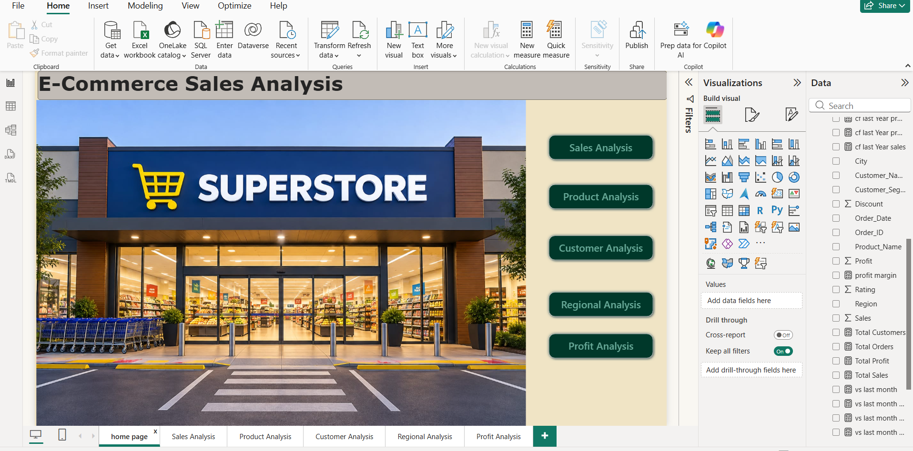
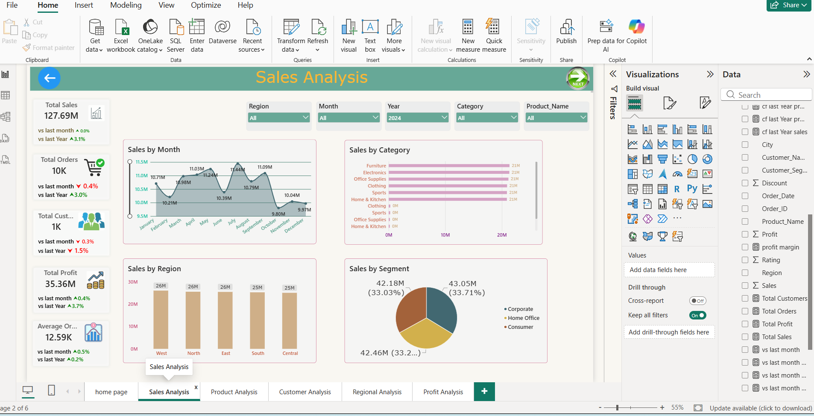
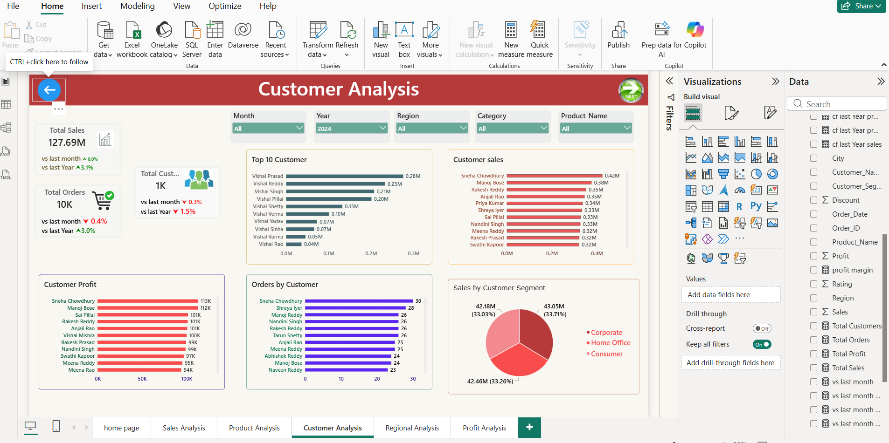
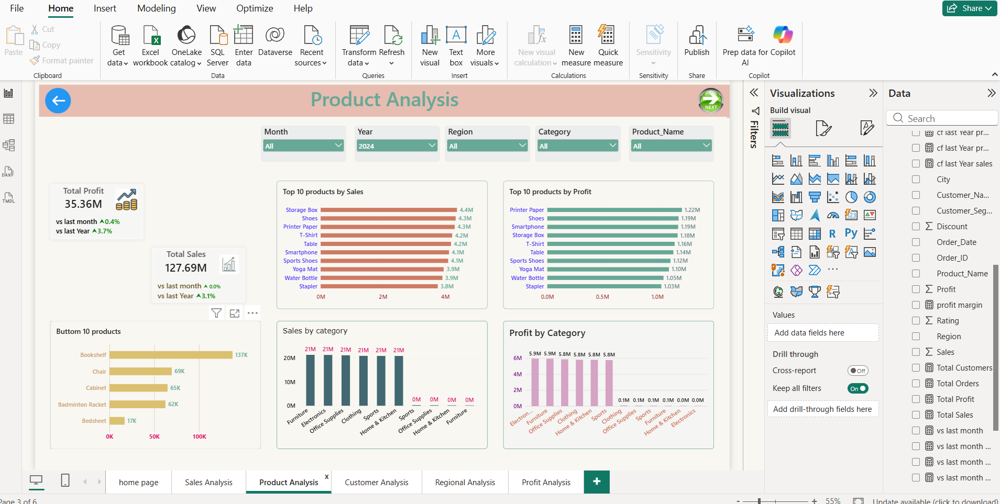
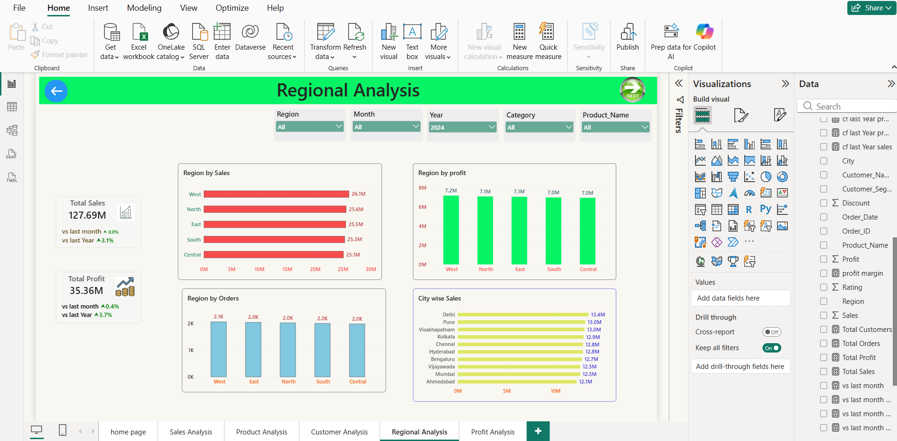

# E-Commerce-Sales-Analysis-PowerBI-dashboard
E-commerce sales analysis Dashboard using Power bi
# E-Commerce Sales Analysis Dashboard

## 📊 Project Overview

This project is an E-Commerce Sales Analysis Dashboard developed using Microsoft Power BI.

The dashboard helps analyze sales performance, customers, products, profitability, and regional performance through interactive visualizations and KPIs.

## 🛠️ Tools & Technologies

- Microsoft Power BI
- Power Query
- DAX
- Excel
- SQL

## 📌 Dashboard Pages

### 🏠 Home
Provides an overview of the business performance and navigation to different analysis pages.

### 💰 Sales Analysis
- Total Sales
- Sales by Month
- Sales by Category
- Sales by Region
- Sales by Segment
- Top Products

### 👥 Customer Analysis
- Customer Sales
- Top Customers
- Customer Profit
- Orders by Customer
- Customer Segment Analysis

### 📦 Product Analysis
- Top 10 Products by Sales
- Top 10 Products by Profit
- Bottom Products
- Sales by Category
- Profit by Category

### 🌎 Regional Analysis
- Sales by Region
- Profit by Region
- Regional Performance Comparison

## 📈 Key KPIs

- Total Sales
- Total Profit
- Total Orders
- Total Customers
- Average Order Value

## 🧹 Data Preparation

The data was prepared and transformed before creating the dashboard.

Key activities included:

- Removing duplicate records
- Handling missing values
- Cleaning text fields
- Formatting columns
- Creating calculated columns
- Creating DAX measures
- Building relationships between data tables

## 💡 Business Insights

The dashboard helps answer questions such as:

- Which region generates the highest sales?
- Which products are most profitable?
- Which categories generate the most revenue?
- Who are the top customers?
- How are sales changing over time?
- Which regions need improvement?

## 📷 Dashboard Screenshots

### Home

### Sales

### Customers

### Products

### Regional Analysis

## 📁 Project Files

- ecommerce sales project.pbix — Power BI dashboard
- Dashboard screenshots — Project visualizations
- README.md — Project documentation

## 🎯 Objective

The objective of this project is to demonstrate practical skills in data cleaning, data analysis, business intelligence, dashboard development, Power BI, DAX, and business insights.

## 👨‍💻 Author

*Vishnu Vardhan Reddy*
